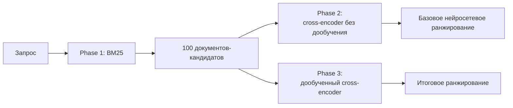

# RuSearchRank

### Ранжирование русскоязычных документов: от BM25 до дообученного cross-encoder

**RuSearchRank** — воспроизводимая двухэтапная система поиска по русскоязычным документам.  
BM25 отбирает 100 кандидатов, после чего cross-encoder уточняет их порядок.

> **Задача:** исследовать, насколько нейросетевое переранжирование улучшает классический поиск и даёт ли дообучение модели дополнительный прирост качества.
>
> **Данные:** русскоязычная часть MIRACL — 4 683 обучающих и 1 252 контрольных запроса. Для каждого запроса BM25 отбирает 100 документов.
>
> **Phase 1:** BM25 формирует исходную поисковую выдачу — `nDCG@10 = 0.3342`.
>
> **Phase 2:** cross-encoder без дообучения перестраивает порядок кандидатов — `nDCG@10 = 0.5365`.
>
> **Phase 3:** модель дообучается на MIRACL-RU с размеченными и дополнительными отрицательными примерами — **`nDCG@10 = 0.5676`**.
>
> **Надёжность результата:** прирост Phase 3 над моделью без дообучения составил **+0.0311**, 95% доверительный интервал — **[0.0248; 0.0374]**.
>
> **Главный вывод:** нейросетевое переранжирование значительно улучшает BM25, а дообучение на русскоязычных данных даёт дополнительный статистически подтверждённый прирост.

---

## Архитектура

Система развивается в три этапа:

1. **Phase 1 — отбор кандидатов.**  
   BM25 быстро находит 100 наиболее подходящих документов.

2. **Phase 2 — нейросетевое переранжирование.**  
   Cross-encoder совместно анализирует запрос и каждый документ без дополнительного обучения на MIRACL-RU.

3. **Phase 3 — дообучение модели.**  
   Cross-encoder обучается на русскоязычных данных и точнее перестраивает тот же список кандидатов.

Phase 2 и Phase 3 — два варианта второго этапа поиска.  
В итоговой системе используется дообученная модель из Phase 3.

Модель не добавляет новые документы, поэтому `Recall@100` остаётся неизменным. Улучшение отражается в качестве порядка первых результатов — `nDCG@10` и `MRR@10`.

---

## Ключевые результаты

| Этап | Система | nDCG@10 | MRR@10 | Recall@100 |
|---|---|---:|---:|---:|
| Phase 1 | BM25 | 0.3342 | 0.4079 | 0.6614 |
| Phase 2 | Cross-encoder без дообучения | 0.5365 | 0.6462 | 0.6614 |
| Phase 3 | **Дообученный cross-encoder** | **0.5676** | **0.6762** | **0.6614** |

- Phase 2 улучшила `nDCG@10` относительно BM25 примерно на **60.5%**.
- Phase 3 дала ещё **+5.8%** относительно модели без дообучения.
- Итоговый прирост относительно BM25 составил около **69.8%**.
- Результат Phase 3 подтверждён статистически на 1 252 запросах.
